<!-- ================================================= -->
<!--  Username : CyberSecNotFound                      -->
<!-- ================================================= -->

<div align="center">
  

<div align="center">
  
</div>

  <br/>
  
  
  
  
  
</div>
  
## 👤 Profile
```txt
Alias   : CyberSecNotFound
Level   : Cyber Security Student / Aspiring Professional
Focus   : Red Team & Blue Team Operations
Mindset : Think like an attacker, defend like a professional

```
  <br/>
## ⚙️ Tech Stack
<div align="center">  </div>

```txt

Operating Systems:
  - Kali Linux
  - Ubuntu Server
  - Windows

Scripting:
  - Bash
  - Python
  - Git & GitHub

```
## 🧪 Labs & Training Platforms

<br>
<div align="center">     </div>

<br>

## 🪪 Certification

<br>

<div align="center">
  
  
  
  
</div>


<br>


## 📊 GitHub Analytics


</div>
<br>
<div align="center">
  <picture>
    <source media="(prefers-color-scheme: dark)" 
            srcset="https://github.com/CyberSecNotFound/CyberSecNotFound/blob/output/github-contribution-grid-snake-dark.svg">
    <source media="(prefers-color-scheme: light)" 
            srcset="https://github.com/CyberSecNotFound/CyberSecNotFound/blob/output/github-contribution-grid-snake.svg">
    
  </picture>
</div>

<br>

## ⚠️ Disclaimer

```txt

All materials in this repository are for educational purposes only.
Unauthorized or illegal use is strictly prohibited.
```
<br>

## 🤝 Contact
```txt
GitHub : https://github.com/CyberSecNotFound
Email : 404notfoundcybersec@protonmail.com
```
<div align="center">   </div>
